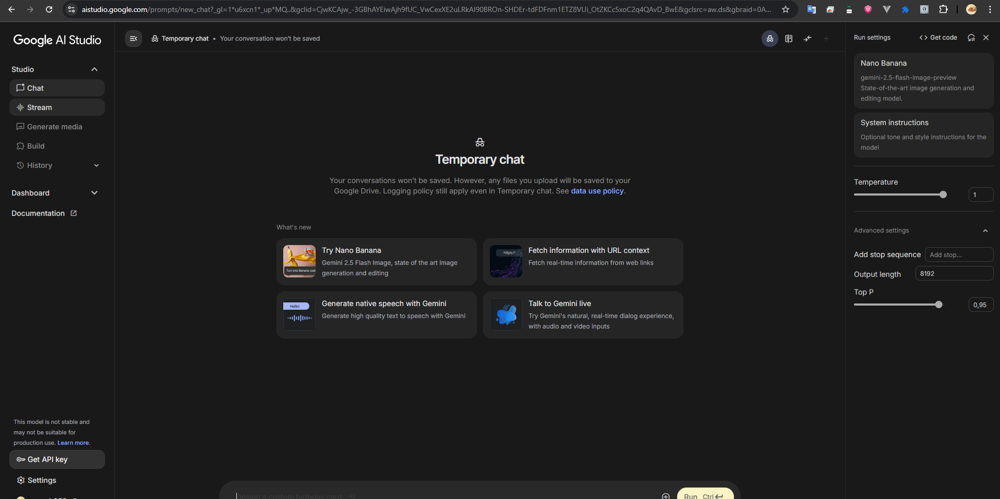
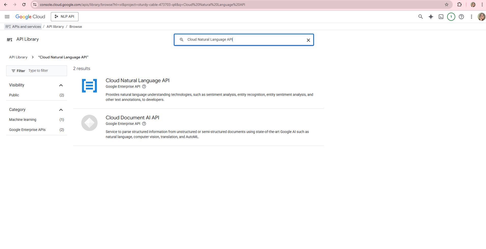
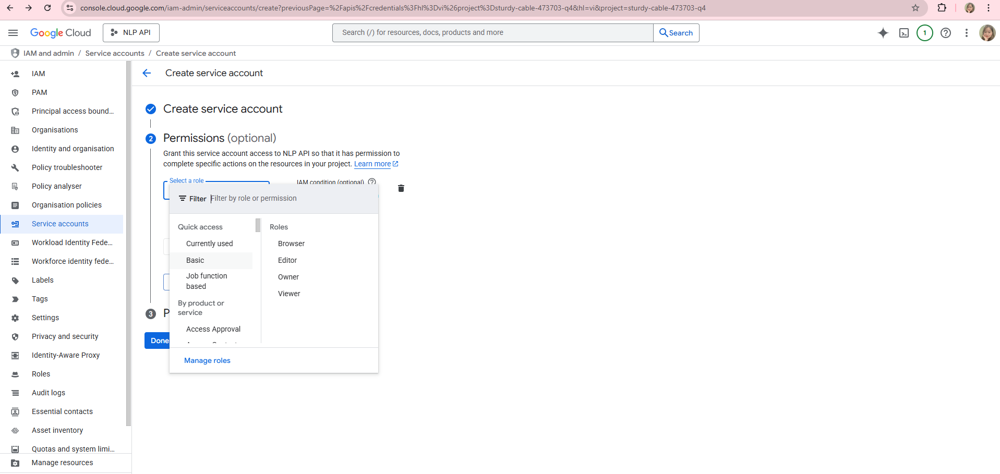
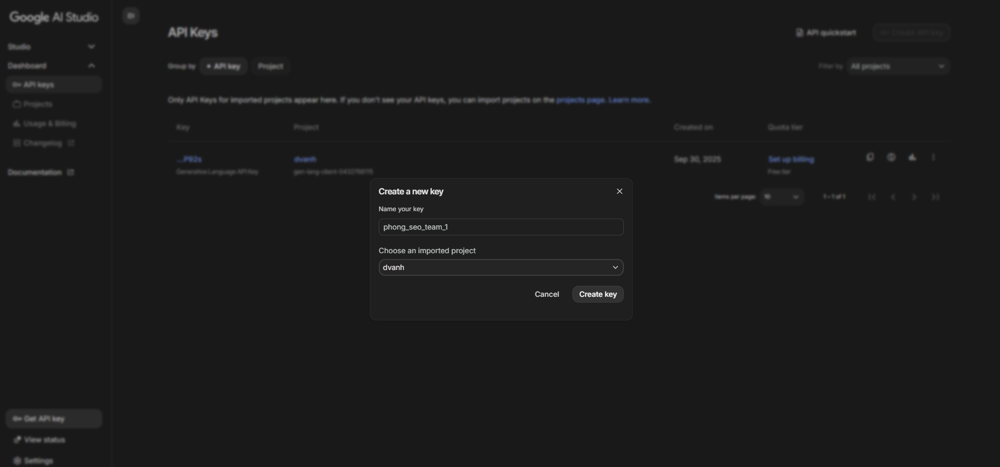
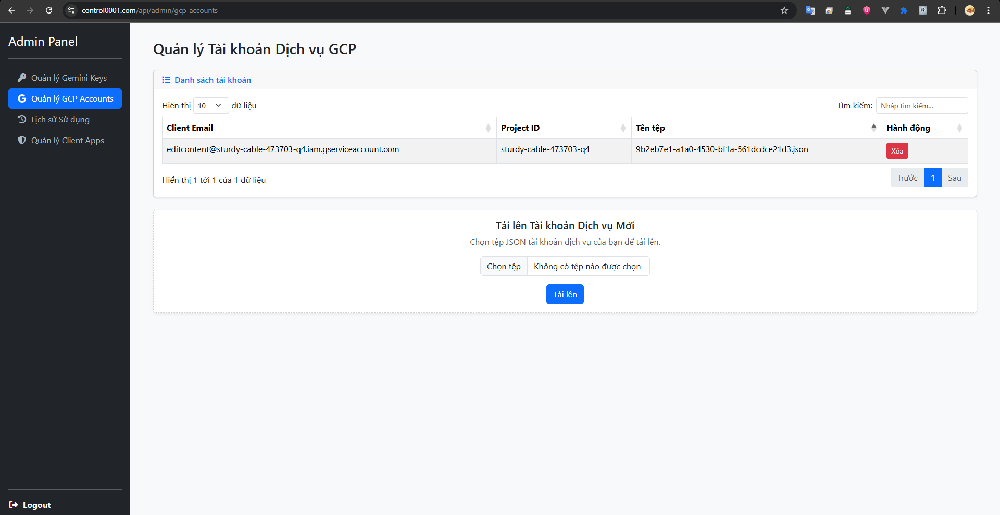
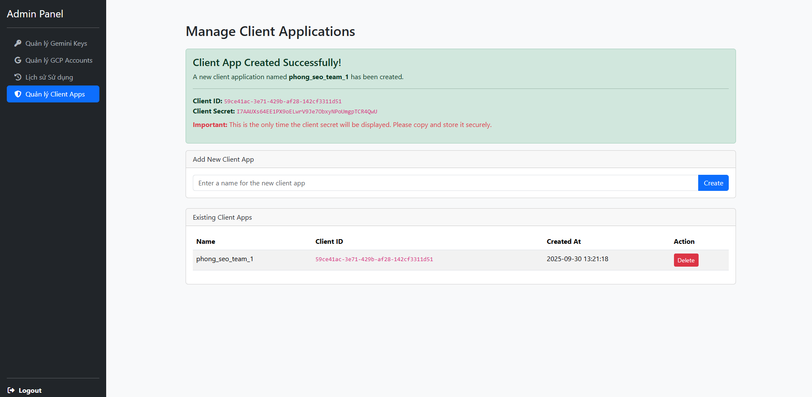
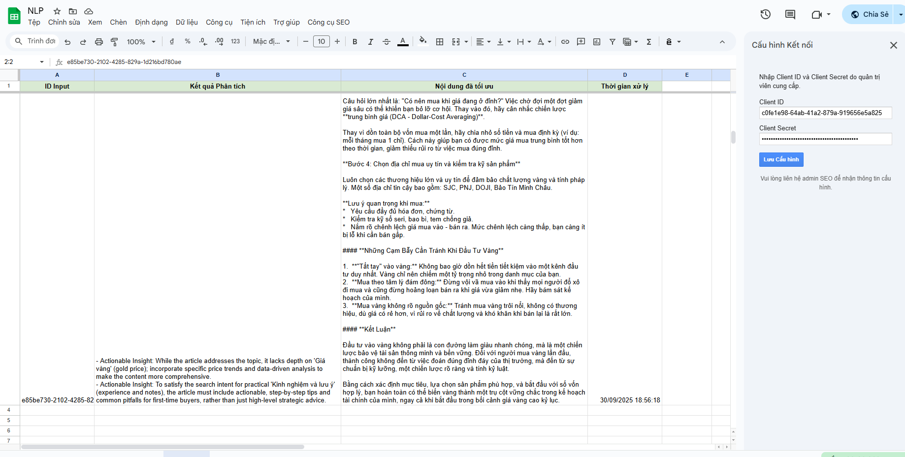
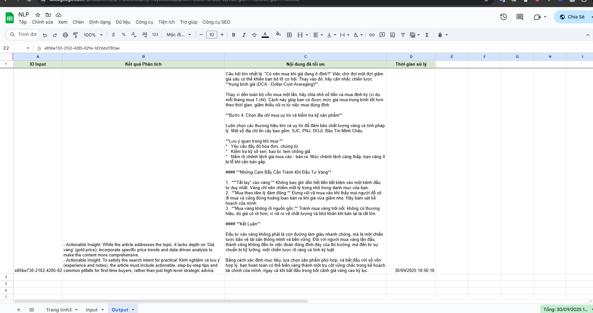

# HƯỚNG DẪN SỬ DỤNG CÔNG CỤ TỐI ƯU HÓA NỘI DUNG SEO

Tài liệu này cung cấp hướng dẫn toàn diện về cách cài đặt, cấu hình và sử dụng công cụ tối ưu hóa nội dung SEO, dành cho cả Quản trị viên hệ thống và Người dùng cuối.

---

## Giới thiệu tổng quan

Công cụ này là một giải pháp mạnh mẽ giúp tự động hóa quy trình phân tích và tối ưu hóa nội dung bài viết chuẩn SEO. Hệ thống bao gồm hai thành phần chính:

1.  **Backend (FastAPI):** Một máy chủ mạnh mẽ, chịu trách nhiệm quản lý API keys, xử lý các yêu cầu phân tích nội dung bằng Google Cloud Natural Language API và viết lại nội dung bằng các mô hình ngôn ngữ lớn (LLM) như Gemini.
2.  **Frontend (Google Apps Script):** Một giao diện tích hợp trực tiếp vào Google Sheets, cho phép người dùng cuối dễ dàng gửi nội dung cần phân tích và nhận lại kết quả mà không cần rời khỏi môi trường làm việc quen thuộc.

**Đối tượng sử dụng:**
*   **Quản trị viên (Admin):** Người chịu trách nhiệm cài đặt, cấu hình và duy trì hệ thống backend.
*   **Người dùng cuối (End-user):** Người làm SEO, content writer, người trực tiếp sử dụng công cụ trên Google Sheets để tối ưu hóa bài viết.

---

## Phần 0: Chuẩn bị (Dành cho Quản trị viên)

Trước khi hệ thống có thể hoạt động, Quản trị viên cần chuẩn bị hai loại "chìa khóa" quan trọng từ Google.

### 0.1. Hướng dẫn lấy Gemini API Key

Gemini API Key được sử dụng để truy cập vào mô hình ngôn ngữ của Google, phục vụ cho việc viết lại và tối ưu hóa nội dung.

1.  **Truy cập Google AI Studio:** Mở trình duyệt và đi đến địa chỉ [https://aistudio.google.com/](https://aistudio.google.com/).
2.  **Đăng nhập:** Sử dụng tài khoản Google của bạn để đăng nhập.
3.  **Tạo API Key:**
    *   Ở góc trên bên trái, nhấp vào nút **"Get API key"**.
    *   Trong trang "Google AI for Developers", chọn **"Create API key in new project"**.
    *   Một API key mới sẽ được tạo ra. Hãy sao chép (copy) và lưu lại chuỗi ký tự này một cách an toàn. Đây chính là key bạn sẽ dùng trong trang quản trị.

**Lưu ý quan trọng:** API Key này giống như một mật khẩu. **Không chia sẻ nó công khai**.

### 0.2. Hướng dẫn tạo file Service Account cho GCP

File JSON của Service Account dùng để xác thực và cho phép backend sử dụng dịch vụ **Cloud Natural Language API** của Google Cloud Platform (GCP).

1.  **Truy cập Google Cloud Console:** Mở trình duyệt và đi đến [https://console.cloud.google.com/](https://console.cloud.google.com/).
2.  **Chọn hoặc tạo Project:**
    *   Nếu bạn đã có project, hãy chọn nó từ thanh menu trên cùng.
    *   Nếu chưa, hãy tạo một project mới.
3.  **Kích hoạt (Enable) Cloud Natural Language API:**
    *   Sử dụng thanh tìm kiếm ở trên cùng, gõ **"Cloud Natural Language API"** và chọn kết quả tương ứng.
    *   Nhấp vào nút **"ENABLE"** nếu API này chưa được kích hoạt cho project của bạn.

4.  **Tạo Service Account:**
    *   Trong thanh tìm kiếm, gõ **"Service Accounts"** và truy cập trang quản lý.
    *   Nhấp vào **"+ CREATE SERVICE ACCOUNT"**.
    *   Đặt tên cho service account (ví dụ: `seo-tool-nlp-user`) và nhấp **"CREATE AND CONTINUE"**.
5.  **Cấp quyền (Grant access):**
    *   Trong mục "Select a role", tìm và chọn quyền **"Basic"** -> **'Editor'**.
    *   Nhấp **"CONTINUE"**, sau đó nhấp **"DONE"**.

6.  **Tạo và tải về file Key JSON:**
    *   Quay lại danh sách Service Accounts, tìm đến tài khoản bạn vừa tạo và nhấp vào nó.
    *   Chuyển sang tab **"KEYS"**.
    *   Nhấp vào **"ADD KEY"** -> **"Create new key"**.
    *   Chọn định dạng là **JSON** và nhấp **"CREATE"**.
    *   Một file `.json` sẽ tự động được tải về máy tính của bạn. Hãy lưu file này cẩn thận.

Bây giờ bạn đã có đủ 2 "chìa khóa" cần thiết. Hãy chuyển sang phần tiếp theo.

---

## Phần 1: Luồng hoạt động tổng quan (Từ A đến Z)

Đây là bức tranh toàn cảnh về cách triển khai và đưa hệ thống vào hoạt động.

1.  **Bước 1 (Quản trị viên): Cấu hình Backend**
    *   Đăng nhập vào trang quản trị của hệ thống.
    *   Vào mục "Manage Gemini Keys" và thêm **Gemini API Key** bạn đã lấy ở Phần 0.1.
    *   Vào mục "Manage GCP Accounts" và tải lên **file Service Account JSON** bạn đã tạo ở Phần 0.2.

2.  **Bước 2 (Quản trị viên): Tạo và cấp quyền truy cập**
    *   Vào mục "Manage Clients".
    *   Tạo một "Client App" mới cho một người dùng hoặc một nhóm người dùng.
    *   Hệ thống sẽ sinh ra một cặp `Client ID` và `Client Secret`.
    *   Gửi cặp thông tin này cho Người dùng cuối.

3.  **Bước 3 (Người dùng cuối): Cấu hình Google Sheet**
    *   Người dùng cuối mở file Google Sheet của họ.
    *   Vào menu `Công cụ SEO` -> `4. Cấu hình`.
    *   Nhập `Client ID` và `Client Secret` được cấp vào sidebar và lưu lại.

4.  **Bước 4 (Người dùng cuối): Sử dụng hàng ngày**
    *   Người dùng tạo template, thêm nội dung vào sheet `Input` và chạy chức năng phân tích.
    *   Kết quả tối ưu sẽ tự động xuất hiện ở sheet `Output`.

---

## Phần 2: Hướng dẫn chi tiết cho Quản trị viên

### 2.1. Đăng nhập và Giao diện
*   **Địa chỉ:** `[URL_BACKEND_CỦA_BẠN]/api/admin/login`

Giao diện quản trị bao gồm các mục chính ở thanh điều hướng bên trái.

### 2.2. Cấu hình hệ thống
Đây là bước đầu tiên và quan trọng nhất sau khi đăng nhập.

*   **Quản lý Gemini API Keys (`/api/admin/gemini-keys`):**
    *   Sử dụng form "Add New Key" để dán Gemini API Key đã lấy ở Phần 0.1 và nhấn "Add Key".
    *   Bạn có thể thêm nhiều key, hệ thống sẽ tự động luân chuyển.

*   **Quản lý tài khoản GCP (`/api/admin/gcp-accounts`):**
    *   Sử dụng form "Upload New GCP Service Account" để tải lên file `.json` đã tạo ở Phần 0.2.

### 2.3. Quản lý Client Apps (`/api/admin/clients`)
Đây là nơi bạn tạo thông tin đăng nhập cho người dùng cuối.

1.  Nhập tên định danh cho người dùng hoặc phòng ban (ví dụ: `phong_seo_team_1`) vào ô "Client App Name".
2.  Nhấn "Create App".
3.  Một cửa sổ sẽ hiện ra, chứa `Client ID` và `Client Secret` mới.
4.  **Hãy sao chép và gửi thông tin này cho người dùng cuối.** Lưu ý: `Client Secret` sẽ chỉ hiển thị một lần duy nhất này.

### 2.4. Xem lịch sử sử dụng (`/api/admin/history`)
Trang này ghi lại mọi yêu cầu xử lý nội dung đã được gửi đến hệ thống. Bạn có thể:
*   Xem nội dung gốc và kết quả trả về.
*   Sử dụng các bộ lọc ở trên cùng để tìm kiếm lịch sử theo email người dùng hoặc theo khoảng thời gian.

---

## Phần 3: Hướng dẫn chi tiết cho Người dùng cuối

### 3.1. Cài đặt ban đầu (Chỉ làm 1 lần)
1.  Mở file Google Sheet bạn sẽ làm việc.
2.  Từ thanh menu, chọn `Công cụ SEO` -> `4. Cấu hình`.
3.  Một sidebar sẽ hiện ra bên phải.
4.  Nhập `Client ID` và `Client Secret` mà Quản trị viên đã cung cấp cho bạn.
5.  Nhấn "Lưu Cấu hình".

### 3.2. Quy trình làm việc hàng ngày

**Bước 1: Tạo Template làm việc**
*   Nếu là lần đầu sử dụng, vào `Công cụ SEO` -> `1. Tạo Template làm việc`.
*   Hành động này sẽ tạo ra 2 sheet mới: `Input` và `Output`.

**Bước 2: Thêm nội dung cần phân tích**
1.  Vào `Công cụ SEO` -> `2. Thêm dòng mới`. Một dòng mới với ID duy nhất và trạng thái "Chờ duyệt" sẽ được tạo trong sheet `Input`.
2.  Điền đầy đủ thông tin vào các cột:
    *   `Nội dung bài viết`: Dán toàn bộ nội dung bài viết gốc.
    *   `Chủ đề chính`: Chủ đề bao quát của bài viết.
    *   `Ý định tìm kiếm`: Mục đích chính của người dùng khi tìm kiếm chủ đề này (ví dụ: "tìm hiểu thông tin", "hướng dẫn cách làm", "so sánh sản phẩm").

**Bước 3: Gửi đi phân tích**
*   Sau khi điền xong thông tin, vào `Công cụ SEO` -> `3. Phân tích Nội dung (Dòng chờ duyệt đầu tiên)`.
*   Công cụ sẽ tự động tìm dòng đầu tiên có trạng thái "Chờ duyệt", đổi trạng thái thành "Đang xử lý" và gửi đi.
*   Sau khi xử lý xong, trạng thái sẽ cập nhật thành "Thành công" hoặc "Lỗi".

**Bước 4: Xem kết quả**
*   Chuyển qua sheet `Output`.
*   Tìm dòng có `ID Input` tương ứng với dòng bạn vừa xử lý.
*   Các cột sẽ chứa:
    *   `Kết quả Phân tích`: Các ghi chú, nhận xét từ AI.
    *   `Nội dung đã tối ưu`: Phiên bản nội dung đã được viết lại.

---

## Phần 4: Giải đáp các lỗi thường gặp

*   **Lỗi "Client ID hoặc Client Secret chưa được cấu hình" (trên Google Sheets):**
    *   **Nguyên nhân:** Bạn chưa thực hiện bước cấu hình ban đầu.
    *   **Cách khắc phục:** Vào `Công cụ SEO` -> `4. Cấu hình` và nhập thông tin do Admin cung cấp.

*   **Lỗi "Không thể lấy access token. Lỗi 401..." (trên Google Sheets):**
    *   **Nguyên nhân:** `Client ID` hoặc `Client Secret` bạn nhập không chính xác.
    *   **Cách khắc phục:** Kiểm tra lại thông tin Admin gửi, đảm bảo không có khoảng trắng thừa. Liên hệ Admin để xác nhận lại nếu cần.

*   **Trạng thái "Lỗi" trong sheet `Input`:**
    *   **Nguyên nhân:** Có thể do một trong các lý do sau:
        1.  Quản trị viên chưa cấu hình Gemini API Key hoặc GCP Service Account trên backend.
        2.  Gemini API Key đã hết hạn hoặc không hợp lệ.
        3.  Backend gặp sự cố tạm thời.
    *   **Cách khắc phục:** Báo cho Quản trị viên để kiểm tra log hệ thống và tình trạng cấu hình backend.
